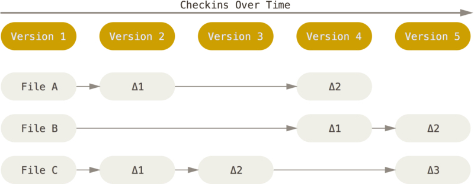
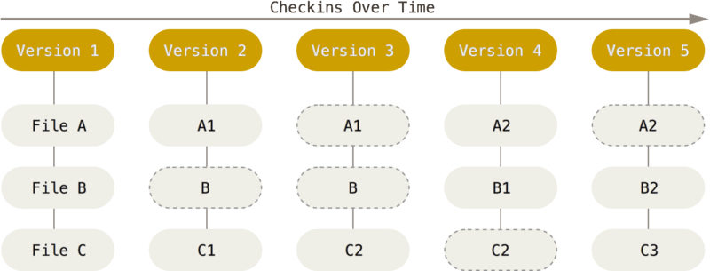
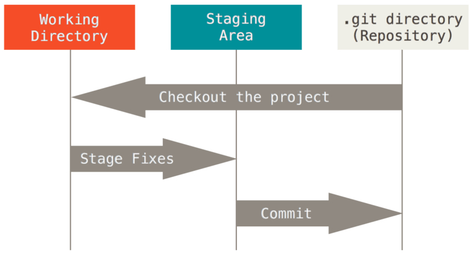

# WHAT IS VCS and DVCS?

## Version Control Source (VCS)
A component of software configuration management, version control, also known as revision control or source control,[1] is the management of changes to documents, computer programs, large web sites, and other collections of information.  

Changes are usually identified by a number or letter code, termed the "revision number", "revision level", or simply « revision".  
For example, an initial set of files is "revision 1 ».  

When the first change is made, the resulting set is "revision 2", and so on. Each revision is associated with a timestamp and the person making the change. Revisions can be compared, restored, and with some types of files, merged.  

## Decentralized Version Control Source (DVCS)
In software development, distributed version control is a form of version control where the complete codebase - including its full history - is mirrored on every developer's computer.  

This allows branching and merging to be managed automatically, increases speeds of most operations (except for pushing and pulling), improves the ability to work offline, and does not rely on a single location for backups.  

## DVCS Advantages Over VCS
The act of cloning an entire repository gives distributed version control tools several advantages over centralized systems:
Performing actions other than pushing and pulling changesets is extremely fast because the tool only needs to access the hard drive, not a remote server.  
Committing new changesets can be done locally without anyone else seeing them. Once you have a group of changesets ready, you can push all of them at once.  
Everything but pushing and pulling can be done without an internet connection. So you can work on a plane, and you won’t be forced to commit several bugfixes as one big changeset.  
Since each programmer has a full copy of the project repository, they can share changes with one or two other people at a time if they want to get some feedback before showing the changes to everyone.  

## DVCS DISAdvantages Over VCS
There are almost no disadvantages to using a distributed version control system over a centralized one. Distributed systems do not prevent you from having a single “central” repository, they just provide more options on top of that.  
There are only two major inherent disadvantages to using a distributed system:  
If your project contains many large, binary files that cannot be easily compressed, the space needed to store all versions of these files can accumulate quickly.  
If your project has a very long history (50,000 changesets or more), downloading the entire history can take an impractical amount of time and disk space.  

# Git
## WHat is GIT?
Git is a distributed version-control system for tracking changes in source code during software development.  
It is designed for coordinating work among programmers, but it can be used to track changes in any set of files.  
Its goals include speed, data integrity, and support for distributed, non-linear workflows. development.  

# Git Principals Objects
## Repository
The purpose of Git is to manage a project, or a set of files, as they change over time.  
Git stores this information in a data structure called a repository.  
A git repository contains, among other things, the following:  
- A set of commit objects.  
- A set of references to commit objects, called heads.  

The Git repository is stored in the same directory as the project itself, in a subdirectory called .git.  
Note differences from central-repository systems like CVS or Subversion:
- There is only one .git directory, in the root directory of the project.  
- The repository is stored in files alongside the project. There is no central server repository.  

## Commit
A commit object contains three things:
- A set of files, reflecting the state of a project at a given point in time.
- References to parent commit objects.
- An SHA1 name, a 40-character string that uniquely identifies the commit object. The name is composed of a hash of relevant aspects of the commit, so identical commits will always have the same name.

The parent commit objects are those commits that were edited to produce the subsequent state of the project.  
Generally a commit object will have one parent commit, because one generally takes a project in a given state, makes a few changes, and saves the new state of the project.  

A project always has one commit object with no parents. This is the first commit made to the project repository.  
Based on the above, you can visualize a repository as a directed acyclic graph of commit objects, with pointers to parent commits always pointing backwards in time, ultimately to the first commit. Starting from any commit, you can walk along the tree by parent commits to see the history of changes that led to that commit.  
The idea behind Git is that version control is all about manipulating this graph of commits. Whenever you want to perform some operation to query or manipulate the repository, you should be thinking, “how do I want to query or manipulate the graph of commits?”  

## Branches
A branch is simply a reference to a commit object.  
Each branch has a name.  
By default, there is a branch in every repository called master.  
A repository can contain any number of branches.  
At any given time, one branch is selected as the “current branch.” This head is aliased to HEAD, always in capitals.  

## Snapshots, no differences
With Git, every time you commit, or save the state of your project, Git basically takes a picture of what all your files look like at that moment and stores a reference to that snapshot.  

To be efficient, if files have not changed, Git doesn’t store the file again, just a link to the previous identical file it has already stored. 

Git thinks about its data more like a stream of snapshots  

*Example of how other systems (CVS, Subversion, Perforce, Bazaar, and so on) think of the information they store as a set of files and the changes made to each file over time (this is commonly described as delta-based version control).*  
 
  

*Example of how GIT thinks of the information they store.*  
 
  

## Three states
Pay attention now — here is the main thing to remember about Git if you want the rest of your learning process to go smoothly.  
Git has three main states that your files can reside in: modified, staged, and committed:

- Modified means that you have changed the file but have not committed it to your database yet.

- Staged means that you have marked a modified file in its current version to go into your next commit snapshot.

- Committed means that the data is safely stored in your local database.


*This leads us to the three main sections of a Git project: the working tree, the staging area, and the Git directory.*  
 
  

# GIT SETTINGS
## Recommanded configuration
The default Git config (.gitconfig file in home folder) can be amended to customize many aspects of Git.  
The configuration options in the table below can be changed in a terminal using command **git config --global <configuration option>**  

| Option description                                                                                | Configuration option                              |
| :-----------                                                                                      | :-----------                                      |
| Use terminal color when available                                                                 | color.ui auto                                     |
| Make “git push” without argument push the current branch to the remote branch with the same name. | push.default simple                               |
| Ensure “git pull” will use rebase instead of merge, preserving existing local merges              | pull.rebase preserve                              |
| Improve “git diff” output of source/target and detect renames                                     | diff.mnemonicPrefix true   diff.renames true   |
| Make “git log” show abbreviated SHA1                                                              | log.abbrevCommit true                             |
| Make Git automatically record and re-apply conflicts resolution                                   | rerere.enabled true                               |
| Automatically add to index auto-resolved conflicts                                                | rerere.autoupdate true                            |


## Recommanded ALIASES
The default Git config (.gitconfig file in home folder) can also be used to define new git commands as aliases.  
The table below provides useful aliases, that can be defined in a terminal using command git config --global alias.<command alias> “<command>”  

| Alias           | Description                                                 | Command                                                                                           |
| :-----------    | :-----------                                                | :-----------                                                                                      |
| tree            | Show improved logs (colors, branch graphs…)                 | log --graph --pretty=tformat:'%Cred%h%Creset -%C(auto)%d%Creset %s %Cgreen(%an %ar)%Creset'       |
| st              | Shortcut for status command                                 | status                                                                                            |
| co              | Shortcut for checkout                                       | checkout                                                                                          |
| oops            | Amend latest commit keeping the same commit message         | commit --amend --no-edit                                                                          |

# GIT CHEAT SHEET
## GIT CHEAT SHEET
| Goal                                                                              | Git commands                                                                                          |
| :-------------------------------------------------------------------------------- | :-------------------------------------------                                                          |
| Start a branch from another one                                                   | git checkout <source branch>   git pull   git checkout –b <target branch>                       |
| Merge a branch into another one (true merge)                                      | git checkout <target branch>    git merge --no-ff <source branch>                                  |
| Merge a branch into another one (rebase then fast-forward)                        | git rebase <target branch>   git checkout <target branch>   git merge --ff-only <source branch> |
| Rebase current branch against its remote counterpart                              | git fetch   git rebase                                                                             |
| Delete a local branch                                                             | git branch –d <branch name>                                                                           |
| Tag current commit                                                                | git tag <tag name>                                                                                    |
| Push tags to remote                                                               | git push --tags                                                                                       |
| Push current branch                                                               | git push   or   git push -u *if branch does not exist yet*                                      |
| Start working on a remote branch                                                  | git fetch   git checkout <branch name>                                                             |

